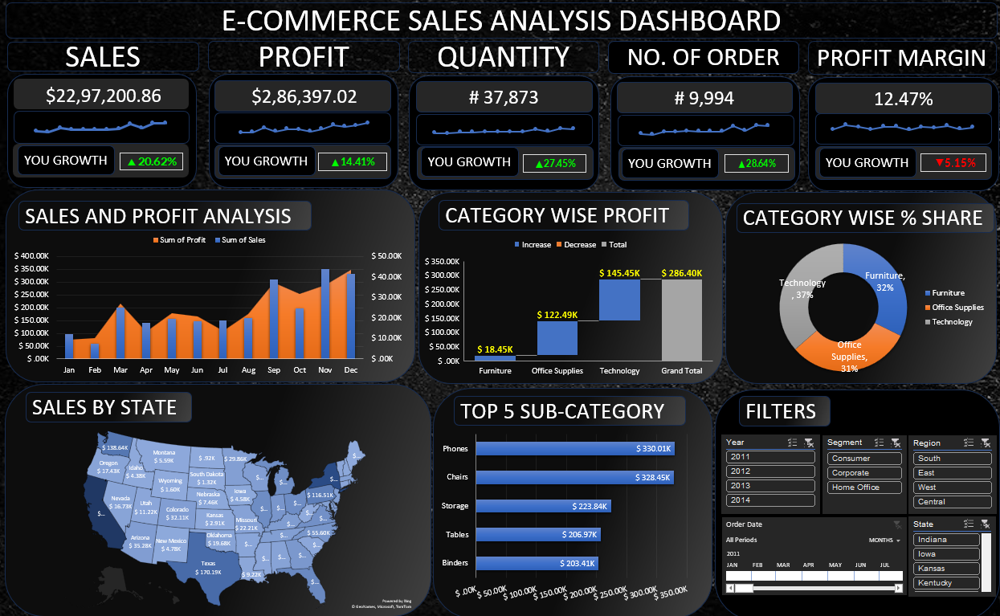
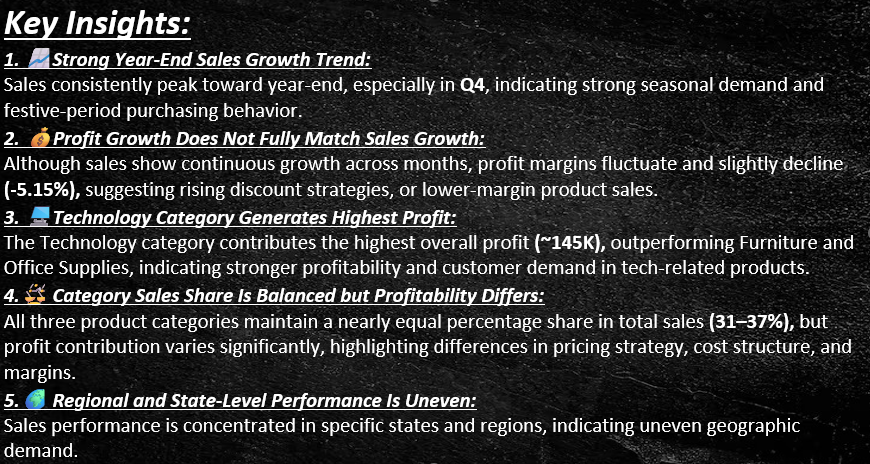
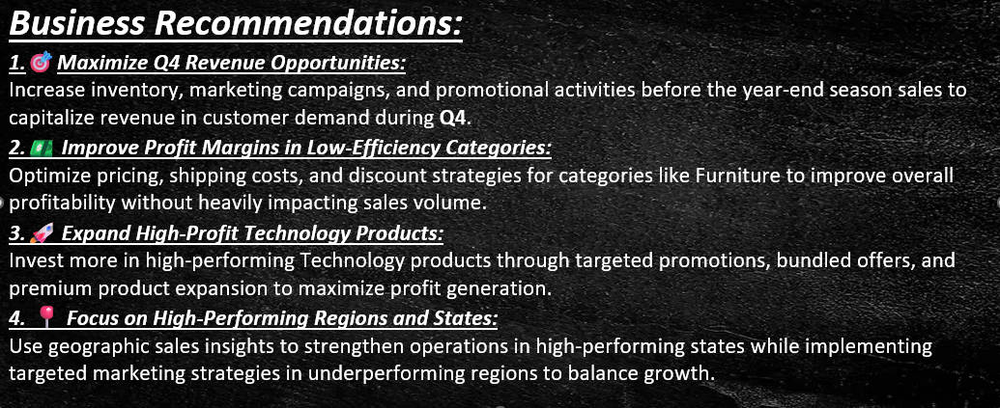

# 📊 E-Commerce Sales Analysis Dashboard - Excel

## 📌 Project Overview

This project presents a complete **E-Commerce Sales Analysis Dashboard** built entirely in **Microsoft Excel** using **Pivot Tables, Pivot Charts, KPIs, Slicers, and Interactive Visualizations**.

The Dashboard analyzes overall **business performance** by tracking:
- Sales Performance
- Profitability
- Order Trends
- Product Categories
- Shipping Preferences
- State-wise Sales Distribution
- Top Performing Sub-Categories

The objective of this project is to transform raw e-commerce transactional data into **actionable insights** that support **data-driven decision-making**.

---

## 💼 Business Problem

E-commerce businesses generate large volumes of transactional data daily. Without proper analysis, it becomes difficult to:

- Track **sales growth** and **profitability**.
- Identify **top-performing products and categories**.
- Understand **customer purchasing behaviour**.
- Analyze **regional sales performance**.

This dashboard helps stakeholders monitor **key business metrics** and identify trends that impact **revneue and profit**.

--- 

## Table of Contents

- [Project Overview](#-project-overview)
- [Business Problem](#-business-problem)
- [Objectives](#-objectives)
- [Dashboard Features](#-dashboard-features)
- [Key KPIs](#-key-kpis)
- [Dashboard Images](#dashboard-images)
- [Key Insights](#-key-insights)
- [Business Recommendations](#-business-recommendations)
- [Dataset Information](#-dataset-information)
- [Dataset Source](#-dataset-source)
- [Tools & Technologies](#️-tools--technologies)
- [Data Cleaning & Preparation](#-data-cleaning--preparation)
- [Project Workflow](#-project-workflow)
- [Project Impact](#-project-impact)
- [Project Structure](#-project-structure)
- [How to Use](#️-how-to-use)
- [Author & Contact](#author--contact)

---

## 🎯 Objectives

- Analyze overall **sales and profit trends**
- Monitor monthly business performance
- Identify **top-performing product categories**
- Understand sales contribution by category
- Analyze **regional sales distribution** across states
- Identify high-performing sub-categories
- Build an interactive **Excel Dashboard** for business reporting

---

## 📌 Dashboard Features

- ✅ Interactive **Excel Dashboard**
- ✅ **KPI Cards**
- ✅ **Pivot Tables & Pivot Charts**
- ✅ **Slicers & Filters**
- ✅ Dynamic **Business Insights**
- ✅ **Sales & Profit Analysis**
- ✅ State-wise Sales Visualization
- ✅ Category-wise Performance Analysis

---

## 📊 Key KPIs

- Total Sales                   = **$2.29M+**
- Total Profit                  = **$286K+**
- Total Quantity Sold           = **37K+**
- Total Orders                  = **9,994**
- Overall Profit Margin         = **12.46%**

---

## 📸 Dashboard Images

### Main Dashboard

- Provides an interactive overivew of **sales, profit, orders, qantity sold, and business performance** across different regions, categories, and time periods.

### Key Insights

- Highlights major analytical findings such as **sales trends, profit patterns, seasonal performance, customer behavior, and category-wise business growth**.

### Business Recommendations

- Presents **data-driven recommendations** to improve profitability, optimize discount strategies, increase high-performing product sales, and support better business decision-making. 

---

## 📈 Key Insights

### 📌 Sales Performance Trend
- Sales showed strong growth during the **final quarter of the year**.
- **November and December** recorded the highest sales performance every year.
- Seasonal trends significantly impact **revenue generation**.

### 📌 Profit Analysis
- Profit trends closely follow sales growth.
- High sales months contribute the majority of yearly profit.
- Some months show lower profit margins despite strong sales, indicating higher operational or discount costs.

### 📌 Category Performance
- Certain product categories contribute to larger share of revenue.
- Category-wise analysis helps identify **high-performing business segments**.

### 📌 State-wise Sales Distribution
- Sales are concentrated in a few high-performing states.
- Regional analysis highlights areas with strong customer demand.

### 📌 Top Performing Sub-Categories
- A small number of sub-categories contribute a major share of total sales.
- Identifying best-selling products supports inventory and marketing decisions.

---

## 🚀 Business Recommendations

- Increase marketing campaigns during **high-performing months**.
- Focus inventory planning on **top-performing product categories**.
- Imporve profit margins by optimizing **discounts and operational costs**.
- Expand business strategies in **high-performing states**.
- Promote **high-performing sub-categories** to maximize revenue.
- Use **dashboard monitoring** for regular business performance tracking.

---

## 📂 Dataset Information

The dataset contains **transactional sales data** from a **fictional retail superstore business**. It includes information related to:

- Orders and Sales Transactions
- Customer Details
- **Product Categories** and Sub-Categories
- Shipping Information
- **Regional and State-wise Sales**
- **Profit and Discount Analysis**

---

## 📂 Dataset Source

Dataset obtained from Kaggle and further cleaned/transformed for dashboard analysis.

Original Dataset:
https://www.kaggle.com/datasets/naveenkumar20bps1137/sample-superstore

---

## 🛠️ Tools & Technologies

- **Microsoft Excel**
- **Pivot Tables**
- **Pivot Charts**
- **Power Query Editor**
- **Slicers**
- **Conditional Formatting**
- **KPIs Cards**
- **Dashboard Design**
- **Data Cleaning Techniques**

---

## 🧹 Data Cleaning & Preparation

The following **data cleaning & preparation** steps were performed:

- Checked **missing values**
- **Removed duplicate records**
- **Standardized Column** Formats
- Verified **data consistency**
- Created **calculated KPIs**
- Built **Pivot Tables for analysis**
- Structured data for **dashboard reporting**

---

## 🔄 Project Workflow

1. Data Collection
2. Data Cleaning & Preparation
3. KPIs Creation
4. Pivot Table Development
5. Data Visualization
6. Interactive dashboard Design
7. Business Insight Generation
8. Final Reporting

---

## 💡 Project Impact

- Imporved understanding of business performance trends.
- Enabled **data-driven decision-making**.
- Simplified **complex sales data** into interactive visual insights.
- Demonstrated practical Excel dashboarding and business analysis skills.

---

## 📂 Project Structure

```bash
Ecommerce_Sales_Analysis_Dashboard/
│
├── Readme.md
├── .gitignore
├── Ecommerce_Sales_Analysis_Report.pdf
│
├── dashboard/                                  # Excel Dashboard File
│   └── Ecommerce Sales Analysis-Dashboard.xlsm
│
├── data/                                       # Excel Original Dataset
│   └── ecommerce_sales_analysis.xlsx
│
└── images/                                     # Images
    ├── Sales_Dashboard.png   
    ├── Key_Insights.png   
    └── BusinessRecommendations.png
```

---

## ▶️ How to Use

1. Download the Excel Workbook.
2. Open the .xlsm file in Microsoft Excel.
3. Enable editing and macros if prompted.
4. Use slicers and filters to interact with the dashboard.
5. Explore different analysis sheets for insights.

---

## 👨‍💻 Author & Contact

Dhammadeep Gajbhiye
Data Analyst
- Email: dhammdeepgajbhiye32@gamil.com
- LinkedIn: (https://linkedin.com/in/dhammadeep-gajbhiye-57b38b16a/)
- GitHub: (https://github.com/dhammdeepgajbhiye32)


⭐ If you like this project

Give it a ⭐ on GitHub and share your feedback.
